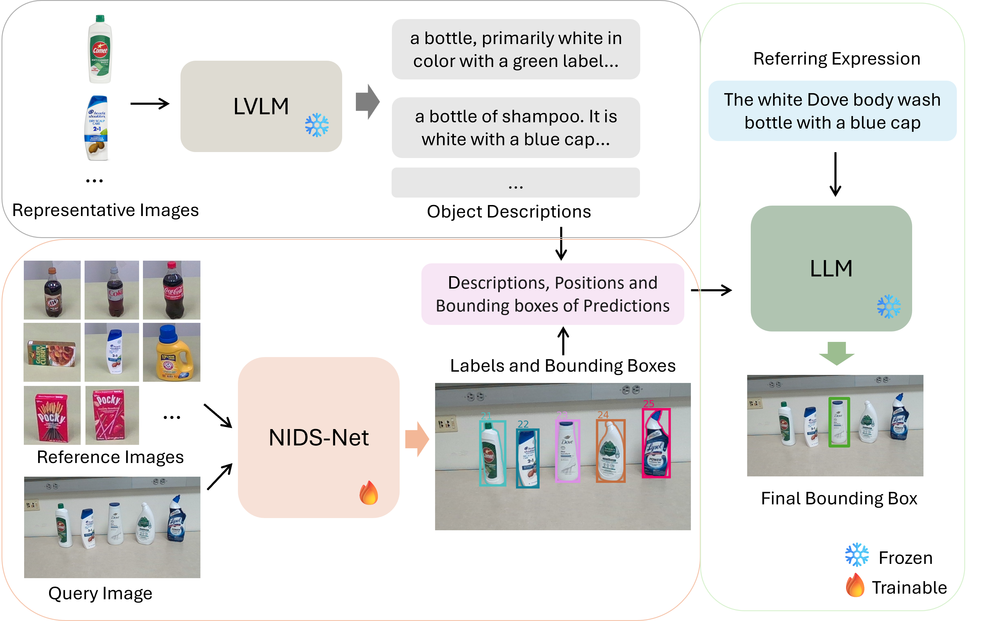

# Multimodal Reference Visual Grounding
[arXiv](https://arxiv.org/abs/2504.02876), [Project](https://irvlutd.github.io/MultiGrounding/), [MultimodalGround Dataset](https://utdallas.app.box.com/s/wqh9z1ljch9sjqr1squyuwjmr894w1gy)

> Visual grounding focuses on detecting objects from images based on language expressions. Recent Large Vision-Language Models (LVLMs) have significantly advanced visual grounding performance by training large models with large-scale datasets. However, the problem remains challenging, especially when similar objects appear in the input image. For example, an LVLM may not be able to differentiate Diet Coke and regular Coke in an image. In this case, if additional reference images of Diet Coke and regular Coke are available, it can help the visual grounding of similar objects.

> In this work, we introduce a new task named Multimodal Reference Visual Grounding (MRVG). In this task, a model has access to a set of reference images of objects in a database. Based on these reference images and a language expression, the model is required to detect a target object from a query image. We first introduce a new dataset to study the MRVG problem. Then we introduce a novel method, named MRVG-Net, to solve this visual grounding problem. We show that by efficiently using reference images with few-shot object detection and using Large Language Models (LLMs) for object matching, our method achieves superior visual grounding performance compared to the state-of-the-art LVLMs such as Qwen2.5-VL-7B. Our approach bridges the gap between few-shot detection and visual grounding, unlocking new capabilities for visual understanding.


## Multimodal Reference Visual Grounding Task


## MultimodalGround Dataset


## Framework


## Visual Grounding Example


## Getting Started
Our environment is built on [NIDS-Net](https://github.com/IRVLUTD/NIDS-Net), so you can refer to the installation instructions provided in the [NIDS-Net repository](https://github.com/IRVLUTD/NIDS-Net).


### Preparing Datasets

We provide the MultimodalGround Dataset in this [link](https://utdallas.app.box.com/s/wqh9z1ljch9sjqr1squyuwjmr894w1gy). The ground truth annotations are in the file "merged_coco_annotations.json". Please put them into a data folder as follows:
```
data_folder
│
└───templates
│   │
│   └───001_a_and_w_root_beer_soda_pop_bottle
│   │   │   images, depth maps, masks
│   │
│   └───002_coca-cola_soda_diet_pop_bottle
│       │   images, depth maps, masks
│       │   ...
│   
│   
└───scenes
    │   scene_001
    │   scene_002
    │   ...
```

## Usage
1. Check GroundingDINO and SAM
- GroundingDINO + SAM: [`test_gdino.py`](test_gdino.py)

2. Download some NIDS-Net files [here](https://utdallas.app.box.com/s/wqh9z1ljch9sjqr1squyuwjmr894w1gy) and  place them in the root folder, including the template embeddings and adapter weights:

- weight of adapter: "adapter_weights/refer_weight_1004_temp_0.05_epoch_640_lr_0.001_bs_1024_vec_reduction_4_weights.pth"
- refined template embeddings: "adapted_obj_feats/refer_weight_1004_temp_0.05_epoch_640_lr_0.001_bs_1024_vec_reduction_4.json"

3. Inference with our method **eval_our_method.py**. We save the result into a json file. Then use **eval_results.py** to evaluate the pridictions.
```shell
bash run_method.sh
```

## Citation
If you find the method useful in your research, please consider citing:
```latex
@misc{lu2025multimodalreferencevisualgrounding,
      title={Multimodal Reference Visual Grounding}, 
      author={Yangxiao Lu and Ruosen Li and Liqiang Jing and Jikai Wang and Xinya Du and Yunhui Guo and Nicholas Ruozzi and Yu Xiang},
      year={2025},
      eprint={2504.02876},
      archivePrefix={arXiv},
      primaryClass={cs.CV},
      url={https://arxiv.org/abs/2504.02876}, 
}
```

## Acknowledgments

This project is based on the following repositories:
- [NIDS-Net](https://github.com/IRVLUTD/NIDS-Net)
- [GroundingDINO](https://github.com/IDEA-Research/GroundingDINO)
- [MobileSAM](https://github.com/ChaoningZhang/MobileSAM)
- [SAM](https://github.com/facebookresearch/segment-anything)
- [DINOv2](https://github.com/facebookresearch/dinov2)
